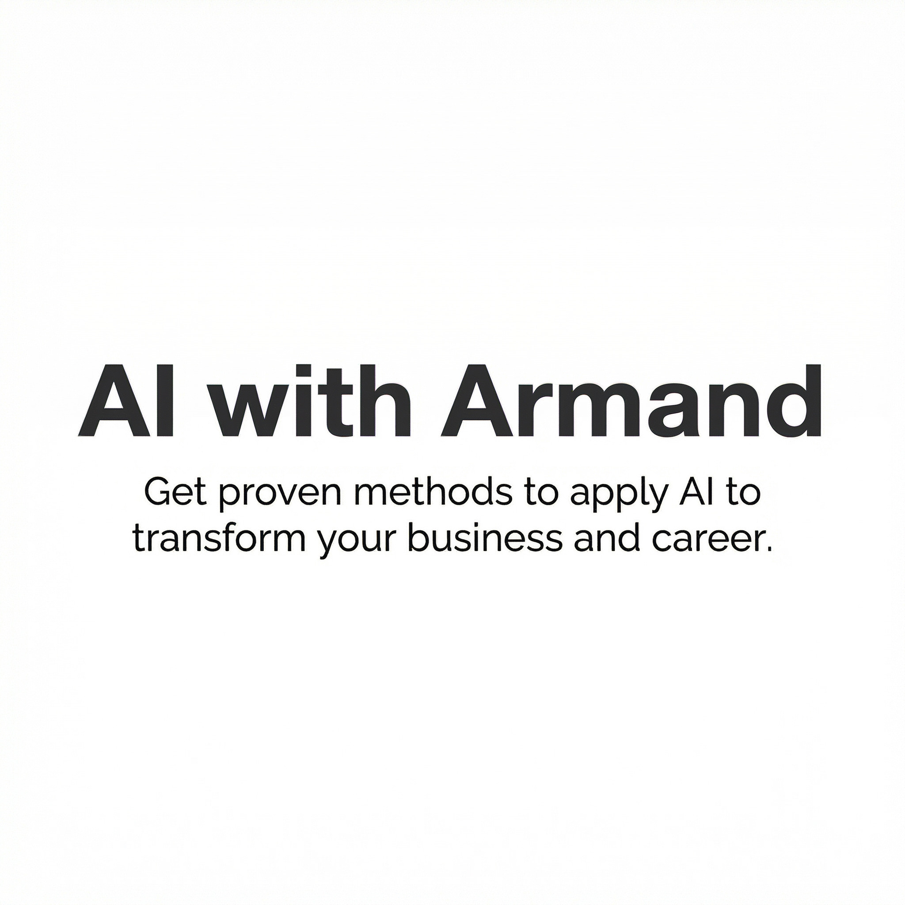

# Hi, I'm Armand

I build AI systems at scale — platforms, agents, and the teams that ship them. Currently at **Meta**. Previously **VP of AI Platform at IBM**. From Barcelona, based in the Bay Area.

## What I'm working on

Right now I'm deep in compound AI systems — moving beyond monolithic models into agents, evals, and the infrastructure that makes them work at scale.

I write about what I learn in **[AI with Armand](https://newsletter.armand.so/)**, a newsletter with 50,000+ subscribers. Recent posts:

| Date | Post |
| --- | --- |
| Apr 2025 | [**Beyond the AI Pilots — Reliable AI, One Eval at a Time**](https://newsletter.armand.so/p/beyond-the-ai-pilots-reliable-ai-one-eval-at-a-time) |
| Jan 2025 | [**Forget RAG and Welcome Agentic RAG!**](https://community.ibm.com/community/user/watsonx/blogs/armand-ruiz-gabernet/2025/01/15/forget-rag-and-welcome-agentic-rag) |
| Sep 2024 | [**All About Meta's Llama Announcements**](https://newsletter.armand.so/p/all-about-metas-llama-announcements) |
| Jul 2024 | [**Essential Qualities for AI Business Leaders**](https://newsletter.armand.so/p/essential-qualities-for-ai-business-leaders) |
| Jun 2024 | [**A Comprehensive Guide to RAG Implementations**](https://newsletter.armand.so/p/a-comprehensive-guide-to-rag-implementations) |
| May 2024 | [**The Rise of the AI Engineer**](https://newsletter.armand.so/p/the-rise-of-the-ai-engineer) |

## Open source

I build and maintain open-source tools for AI developers at [the-nocode-ai](https://github.com/the-nocode-ai) and [replier-ai](https://github.com/replier-ai).
